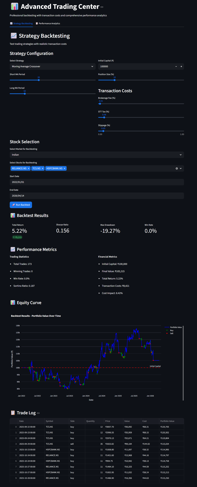
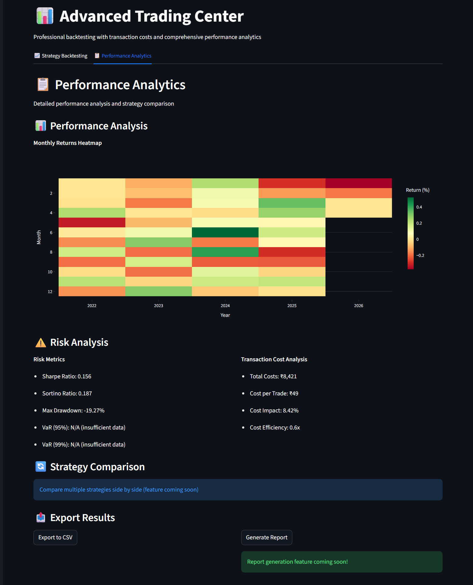

# StockAI - AI-Powered Stock Market Intelligence


[](https://github.com/digantk31/StockAI)
[](https://stockai-app.streamlit.app/)

## 📌 Overview
 
StockAI is a comprehensive **AI/ML-powered Stock Intelligence Platform** built as a final year BTech CSE project. It combines statistical modeling, deep learning, ensemble methods, and NLP to analyze stocks, forecast prices, optimize portfolios, and backtest trading strategies with realistic transaction costs.

The application has four main modules:
1.  **Stock Forecast** — Predict future prices using time-series analysis (SARIMAX)
2.  **Portfolio Analysis** — Find the best stock combinations using optimization & risk analysis
3.  **Advanced AI** — Multiple AI models for price prediction, trend signals, and news sentiment
4.  **Trading Center** — Professional backtesting engine with transaction costs and multi-market support
 
StockAI is a comprehensive **AI/ML-powered Stock Intelligence Platform** built as a final year BTech CSE project. It combines statistical modeling, deep learning, ensemble methods, and NLP to analyze stocks, forecast prices, and optimize portfolios.

The application has three main modules:
1.  **Stock Forecast** — Predict future prices using time-series analysis (SARIMAX)
2.  **Portfolio Analysis** — Find the best stock combinations using optimization & risk analysis
3.  **Advanced AI** — Multiple AI models for price prediction, trend signals, and news sentiment
>>>>>>> 6386e94637a22f90201315ae3415d652ac7ba5f0

## 🚀 Key Features

### 1. Stock Price Forecasting
- **Time Series Breakdown** — Visual separation of trend, seasonality, and noise
- **Customizable Model** — Adjust forecasting parameters (p, d, q) and seasonal settings (P, D, Q, S)
- **Stability Check** — Augmented Dickey-Fuller test to verify data is forecastable
- **Real-World Accuracy Check** — Backtesting: hides last 30 days to honestly test predictions
- **Interactive Charts** — Plotly-powered Actual vs Model Fit vs Forecast visualization

### 2. Portfolio Analysis
- **Stock Connections** — Interactive correlation heatmap showing how stocks move together
- **Performance Comparison** — Cumulative returns vs NIFTY 50 benchmark
- **Risk vs Return Map** — Efficient Frontier with 1000+ simulated portfolios
- **Best Portfolios** — Finds the **Best Returns** and **Safest** portfolio combinations
- **Allocation Charts** — Pie charts showing how to split your investment
- **Safety Analysis** — Market Sensitivity (Beta), Biggest Loss from Peak, and crash simulation

### 3. Advanced AI (6 AI/ML Algorithms)
- **FinBERT Sentiment** — Reads news headlines using a financial AI language model (HuggingFace Transformer). Falls back to TextBlob if unavailable.
- **AI Trade Signal** — Random Forest Classifier on price patterns (RSI, SMA) predicts Buy/Sell with confidence and **feature importance chart**
- **MLP Neural Network** — Multi-Layer Perceptron for 30-day price forecast
- **LSTM Deep Learning** — Long Short-Term Memory recurrent network (TensorFlow/Keras) for sequential price prediction. Falls back to GradientBoosting with temporal features if TensorFlow unavailable.
- **Model Comparison** — Side-by-side MLP vs LSTM with combined forecast chart and metrics (R², RMSE, MAE)
- **Auto-fallback** — Gracefully switches to alternative models based on available libraries

 
### 4. Trading Center & Backtesting Engine
- **Multi-Market Support** — Trade Indian (NSE), US (NYSE/NASDAQ), and European stocks with automatic market detection
- **Professional Backtesting** — Test strategies with realistic transaction costs (brokerage fees, STT, slippage)
- **Strategy Framework** — Moving Average Crossover, RSI Mean Reversion, MACD strategies with extensible architecture
- **Performance Analytics** — Sharpe ratio, Sortino ratio, max drawdown, VaR, win rate, and comprehensive risk metrics
- **Trade Visualization** — Equity curves with buy/sell markers, trade logs, and performance attribution
- **Transaction Cost Modeling** — Realistic cost simulation for Indian markets (brokerage, STT, other charges)
- **Risk Management** — Position sizing, stop-loss, and portfolio risk metrics

 
>>>>>>> 6386e94637a22f90201315ae3415d652ac7ba5f0
## 🛠️ Technologies Used
| Category | Technology |
|----------|-----------|
| Frontend | Streamlit (dark theme) |
| Data Source | Yahoo Finance (`yfinance`) |
| Statistical Modeling | statsmodels (SARIMAX) |
| Machine Learning | Scikit-Learn (MLP, Random Forest, GradientBoosting) |
| Deep Learning | TensorFlow/Keras (LSTM) |
| NLP | FinBERT (HuggingFace Transformers) + TextBlob (fallback) |
| Portfolio Optimization | SciPy (`scipy.optimize`) |
 
| Real-time Data | WebSocket, Asyncio, WebSockets (framework) |
| Backtesting Engine | Custom strategy framework with transaction costs |
 
>>>>>>> 6386e94637a22f90201315ae3415d652ac7ba5f0
| Visualization | Plotly (interactive charts) |
| Data Processing | Pandas, NumPy |

## 📁 Project Structure
```
StockAI/
├── app.py                          # Entry point & navigation
├── .streamlit/
│   └── config.toml                 # Dark theme configuration
├── views/                          # Streamlit page modules
│   ├── __init__.py
│   ├── forecast_page.py            # SARIMAX forecasting page
│   ├── portfolio_page.py           # Portfolio analysis page
 
│   ├── ai_page.py                  # Advanced AI insights page
│   └── trading_page.py             # Trading center & backtesting interface
├── src/                            # Core analytics & AI engine
│   ├── __init__.py
│   ├── ai_features.py              # MLP, LSTM, GradientBoosting, Random Forest, FinBERT
│   ├── data_fetcher.py             # Yahoo Finance data fetching & multi-market support
 
│   └── ai_page.py                  # Advanced AI insights page
├── src/                            # Core analytics & AI engine
│   ├── __init__.py
│   ├── ai_features.py              # MLP, LSTM, GradientBoosting, Random Forest, FinBERT
│   ├── data_fetcher.py             # Yahoo Finance data fetching & cleaning
>>>>>>> 6386e94637a22f90201315ae3415d652ac7ba5f0
│   ├── returns_analysis.py         # Daily, monthly, annual returns & CAGR
│   ├── correlation_analysis.py     # Correlation matrix & diversification metrics
│   ├── portfolio_optimizer.py      # Mean-variance optimization & efficient frontier
│   ├── risk_metrics.py             # Sharpe, Sortino, Beta, Alpha, VaR
 
│   ├── stress_testing.py           # Stress scenarios, drawdown & VaR/CVaR
│   ├── real_time_data.py           # Real-time streaming architecture (WebSocket ready)
│   └── backtesting_engine.py       # Professional backtesting with transaction costs
├── config/
│   ├── __init__.py
│   └── config.py                   # Multi-market tickers, benchmarks, trading parameters
 
│   └── stress_testing.py           # Stress scenarios, drawdown & VaR/CVaR
├── config/
│   ├── __init__.py
│   └── config.py                   # Tickers, date ranges, risk-free rate, scenarios
>>>>>>> 6386e94637a22f90201315ae3415d652ac7ba5f0
├── .gitignore
├── requirements.txt
└── README.md
```

## 📋 Installation

1. Clone the repository:
```bash
git clone https://github.com/digantk31/StockAI.git
cd StockAI
```

2. Create and activate a virtual environment (**Python 3.12 recommended**):
```bash
py -3.12 -m venv venv
# Windows
venv\Scripts\activate
# macOS/Linux
source venv/bin/activate
```

3. Install dependencies:
```bash
pip install -r requirements.txt
pip install tensorflow transformers torch
```

> **Note**: `tensorflow`, `transformers`, and `torch` are optional. The app works without them using built-in fallback models (GradientBoosting for LSTM, TextBlob for FinBERT).

4. Run the application:
```bash
streamlit run app.py
```

 
### 🌍 Multi-Market Setup
The app supports multiple stock markets out of the box:
- **Indian Market**: NIFTY 50 stocks (`.NS` suffix) - Benchmark: NIFTY 50 (^NSEI)
- **US Market**: Major NYSE/NASDAQ stocks - Benchmark: S&P 500 (^GSPC)  
- **European Market**: UK, German, Swiss, Dutch, French stocks - Benchmark: STOXX 50 (^STOXX50E)

### 🔧 Real-time Data (Optional)
For real-time streaming, you can optionally configure WebSocket APIs:
- Alpha Vantage (free tier available)
- IEX Cloud
- Yahoo Finance (polling fallback included)

## 🖥️ How to Use
1.  **Navigate** using the sidebar to choose between pages
2.  **Stock Forecast** — Enter a stock ticker (e.g., AAPL), adjust settings, click "Run Forecast". Use backtesting to check real-world accuracy.
3.  **Portfolio Analysis** — Select market and stocks to see which combination gives best returns with least risk. Supports multi-market optimization.
4.  **Advanced AI** — Enter a ticker to get AI-powered sentiment, trend signals, and price predictions from multiple models.
5.  **Trading Center** — Test trading strategies with realistic transaction costs, analyze performance metrics, and export results.

### 📈 Trading Center Usage:
- **Strategy Backtesting**: Configure moving average parameters, transaction costs, and test on historical data
- **Performance Analytics**: Review Sharpe ratio, max drawdown, win rate, and comprehensive risk metrics
- **Multi-Market Testing**: Backtest strategies across Indian, US, and European markets
- **Export Results**: Download backtest results and trade logs for further analysis
 
## 🖥️ How to Use
1.  **Navigate** using the sidebar to choose between pages
2.  **Stock Forecast** — Enter a stock ticker (e.g., AAPL), adjust settings, click "Run Forecast". Use backtesting to check real-world accuracy.
3.  **Portfolio Analysis** — Enter multiple tickers (e.g., `RELIANCE.NS, TCS.NS, HDFCBANK.NS`) to see which combination gives best returns with least risk.
4.  **Advanced AI** — Enter a ticker to get AI-powered sentiment, trend signals, and price predictions from multiple models.
5.  **Trading Center** — Test trading strategies with realistic transaction costs, analyze performance metrics, and export results.

## 📸 What You'll See
- **Risk vs Return Map** — Scatter plot showing best portfolio combinations
- **AI Price Forecast** — 30-day future price prediction from two AI models
- **News Sentiment** — Table of recent news with positive/negative scores
- **Model Comparison** — Which AI model predicts better for your stock
- **Feature Importance** — What factors the AI relies on most
 
- **Backtest Results** — Equity curves with buy/sell markers, performance metrics, and trade logs
- **Multi-Market Analysis** — Portfolio optimization across different global markets
- **Transaction Cost Impact** — Realistic cost analysis for trading strategies

## 📸 Sample Outputs

### Stock Price Forecast


### Portfolio Optimization


### Risk vs Return Map (Efficient Frontier)


### AI Model Comparison (MLP vs LSTM)


### AI Insights — Sentiment & Feature Importance


 
### Trading Center — Strategy Backtesting


### Performance Analytics — Risk Metrics


## 📸 **Required Screenshots for Assets Folder:**

### 1. **trading_backtest.png**
- **Location**: Trading Center → Strategy Backtesting
- **Show**: Backtest results, equity curve with buy/sell markers, trade log table

### 2. **performance_analytics.png**
- **Location**: Trading Center → Performance Analytics  
- **Show**: Risk metrics dashboard, Sharpe ratio, max drawdown, transaction cost analysis

## ⚠️ Disclaimer
This application is built for **educational and academic purposes only**. The predictions, signals, and analysis should **not** be used as financial advice or for real trading decisions.

## 🔗 Links
- **GitHub Repository**: [GitHub](https://github.com/digantk31/StockAI)

## 👤 Author
- **Digant Kathiriya**
